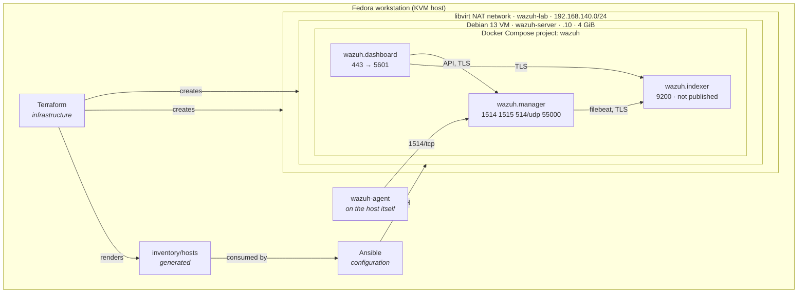
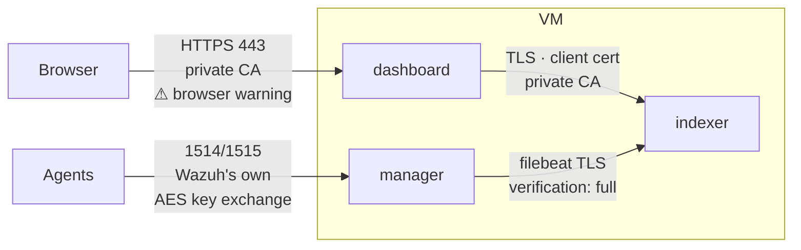

# Architecture

## The two layers, and why the boundary is where it is



Terraform stops at *"a VM exists, it has a known address, and SSH answers"*. Everything
inside the guest is Ansible's.

That is not a stylistic preference. It buys three concrete things:

1. **Configuration changes do not rebuild the VM.** Adjusting a Wazuh rule, changing the
   indexer heap or opening a port is `make configure` — a minute — not a destroy and
   re-provision.
2. **Configuration is idempotent and re-runnable.** cloud-init runs once per instance,
   by design. Anything you put there you can only change by replacing the machine.
3. **The layers migrate independently.** Swap the VM module for a cloud one and the
   entire Ansible layer is untouched, because it only ever knew an IP address and a
   username.

cloud-init still exists, deliberately minimal: create the `admin_username` account,
install the SSH key, install `qemu-guest-agent` and `python3-apt`, grow the root
filesystem. Just enough to make the VM manageable.

### Two accounts, on purpose

The account cloud-init creates and the account Ansible connects as are separate
variables (`admin_username` and `ansible_user`), because they are separate jobs:

| | created by | purpose | can change on a live host |
|---|---|---|---|
| `admin` | cloud-init, at first boot | break-glass login that does not depend on Ansible having worked | no — cloud-init is gated on instance-id, so it only runs once |
| `wazuh-ansible` | `roles/bootstrap` | the automation account every playbook uses | yes |

Conflating them looks tidier and costs you the ability to rotate the automation account:
editing `admin_username` on a running VM re-renders the user-data and the generated
inventory while the guest keeps the account it already has, so the inventory names a
user that does not exist and every playbook fails at connection. Keeping them apart is
what lets `make bootstrap` create a replacement, `ansible_user` point at it, and the old
one be retired with `bootstrap_revoke_users` — no rebuild.

Hosts Terraform did not create have no cloud-init account at all, which is exactly what
`roles/bootstrap` exists to supply. That is why every managed host, lab VM or rented
VPS, ends up reachable the same way.

---

## Trust boundaries



Every internal hop is TLS, signed by a private CA generated on first deploy by Wazuh's
own `wazuh-certs-generator` container.

The certificates name the **container** hostnames — `wazuh.indexer`, `wazuh.manager`,
`wazuh.dashboard` — not the VM's address. Two consequences:

- The bundle is identical on a laptop and on a VPS. Nothing about it is
  environment-specific, which is why it is generated once and never templated per host.
- Your browser will warn about the dashboard's certificate, because it is issued by a CA
  your browser has never heard of, for a name that is not the address you typed. On a
  VPS, terminate TLS in front of the dashboard with a real certificate instead of trying
  to make this bundle browser-friendly.

### Active response: the manager can run code as root on every agent

The sharpest trust boundary in the deployment is not a network one, and it points the
opposite way from the diagram above.

`<active-response>` lets the **manager** ask any agent to execute a script, and that script
runs **as root**, unattended, because `wazuh-execd` runs as root. So the manager is not just
a collector that agents send data to: it is a control plane with root execution across every
host that reports to it. A compromised manager is a compromised estate.

Three consequences that shaped the code:

- The scripts do as little as possible with that power.
  [`yara.sh`](../ansible/roles/yara/templates/yara.sh.j2) reads one file and runs `yara`. It
  does not delete, does not kill processes, does not open a socket. The `firewall-drop`
  response Wazuh ships — which edits the agent's firewall from a manager decision — is
  deliberately **not** enabled.
- The trigger is narrowed on both sides: `<rules_id>` on the manager, and a path allowlist,
  a size ceiling and a `flock` in the script. Rule 554 fires for *any* new file in *any*
  monitored path, so an unbounded trigger means a `git clone` under `/home` launching
  hundreds of root scans.
- It is **off by default** and enabled per host — `yara_enabled` on the agent side,
  `wazuh_yara_active_response` on the manager side — rather than switched on because it
  happens to be installed.

Accepting this boundary knowingly is the point: the capability is what makes automated
response possible at all, and it cannot be had without granting it. See
[YARA.md](YARA.md#known-limitations).

### What the firewall does and does not do

`ufw` is installed and configured, and it does **not** protect the Wazuh containers.

Docker inserts its rules into the `DOCKER` chain, which is traversed before ufw's. A
published container port is reachable even when ufw's policy says deny. Every port the
stack publishes falls into that category.

What ufw protects here is SSH and any future non-Docker service. On this lab's NAT
network that is acceptable — nothing outside the hypervisor can route to
`192.168.140.0/24` at all, so the network boundary is the real control. On a VPS it is
not acceptable; see [PORTING-TO-VPS.md](PORTING-TO-VPS.md).

This is written down rather than glossed over because a firewall you believe in and that
does not work is worse than no firewall.

---

## Data flow

| Step | What happens |
|---|---|
| 1 | An agent on a monitored host collects logs, file-integrity events and inventory |
| 2 | It ships them to `wazuh.manager` on **1514/tcp**, encrypted with the key established at enrolment |
| 3 | `analysisd` decodes and evaluates them against the rule set in `ossec.conf` and produces alerts |
| 4 | `filebeat` forwards alerts to `wazuh.indexer` over TLS with `verification_mode: full` |
| 5 | The indexer writes them into daily `wazuh-alerts-*` indices |
| 6 | `wazuh.dashboard` queries those indices, and calls the manager's API on **55000** for agent state and configuration |

Steps 3 and 4 also run in reverse for active response: when an alert matches an
`<active-response>` block the manager sends a command **back down** the same 1514 channel,
`wazuh-execd` on the agent runs the script as root, and its output returns as an ordinary
log line to be decoded and evaluated like any other. That return trip is how a YARA match
becomes an alert naming the malware family — see [YARA.md](YARA.md).

Which is why an API password that fails Wazuh's complexity rule presents as an *empty
Agents view*: steps 1-5 work perfectly, and step 6 half-fails. `make verify`
authenticates against the API explicitly to catch exactly this.

---

## Storage

```
<storage_pool path>/                            libvirt pool, `var.storage_pool`
├── debian-13-genericcloud-amd64.qcow2          base image, read-only backing store
├── wazuh-server-root.qcow2                     copy-on-write overlay
└── wazuh-server-seed.iso                       cloud-init NoCloud datasource
```

Find the real path with `virsh pool-dumpxml <pool> | grep path`.

The base image is a separate Terraform resource so `destroy` followed by `apply` reuses
it instead of re-downloading ~400 MiB. The overlay is thin-provisioned: `vm_disk_gib` is
a ceiling, and real usage after deployment is roughly 8 GiB.

Thin provisioning means running out of space fails at *write* time, typically while the
indexer is committing a segment — which corrupts a shard rather than returning a clean
error. `make preflight` checks free space for this reason.

Inside the VM, Wazuh data lives in named Docker volumes, so `docker compose down` does
not destroy your alert history. Wiping it is an explicit act: `make nuke`.

---

## Why a dedicated network

The lab creates its own NAT network rather than using libvirt's shared `default`:

- **Ownership.** Terraform can create, reserve addresses on, and destroy a network it
  made. Mutating a pre-existing `default` that other VMs use means `terraform destroy`
  here breaks them.
- **Reservations.** `libvirt_network.ips[].dhcp.hosts` pins `52:54:00:8a:01:10` to
  `.10`. A stable address is what lets every agent keep a fixed `WAZUH_MANAGER` across
  rebuilds — without it, every `make destroy && make up` orphans every agent.
- **Isolation.** The lab cannot interfere with the other VMs on this hypervisor.

One consequence worth knowing: guests on libvirt's `default` network (`192.168.122.0/24`)
cannot reach `192.168.140.0/24` by default, since libvirt only adds forwarding rules for
its own bridge. Agents should run on the KVM host itself — which reaches the network
directly, and is the machine you actually want to monitor — or on VMs attached to
`wazuh-lab`.
